**Lab 6 Paul CHEVALIER & Mathis CAUCHIE**

Commande de création de box nommé ‘centos/7’ pour ‘Virtualbox’ (choix 3) :
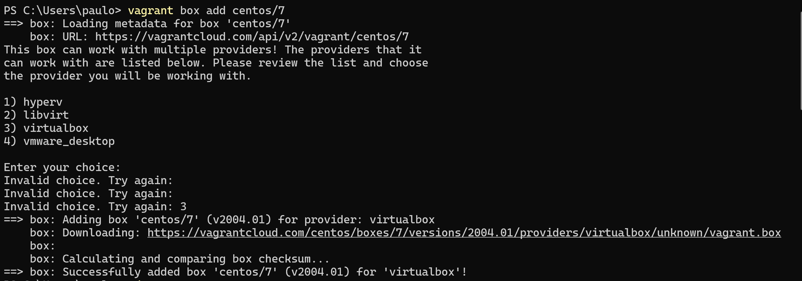

On entre dans le répertoire « part-1 » situé dans le dossier « lab6 » puis on analyse le type du fichier Vagrantfile. On voit que c’est un fichier qui répertorie des commandes pour définir et créer une machine virtuelle. Lorsque l’on démarre la machine virtuelle, le texte « Hello world est affiché :
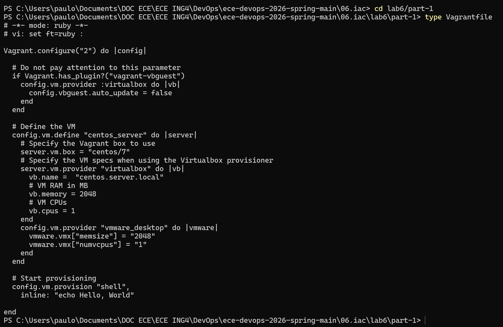

Commande « vagrant up » exécutée ce qui démarre la VM. La VM lancée est celle dans laquelle la « Vagrantfile » est dans le répertoire courant. On voit bien le message « Hello wolrd » s’afficher ce qui montre qu’on est bien dans la machine virtuelle :

La commande « vagrant status » permet de regarder le statut de la machine courante. Ici, le terminal nous renvoie que la VM est en fonctionnement et elle nous donne des commandes pour l’interrompre complètement ou la suspendre simplement :
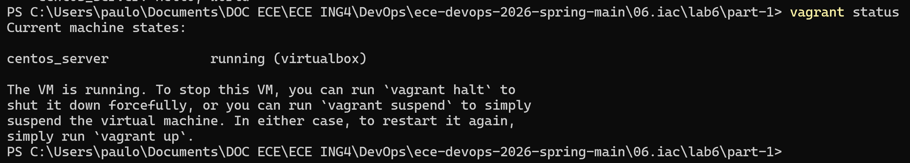

La commande « Vagrant halt » arrête la VM simplement :
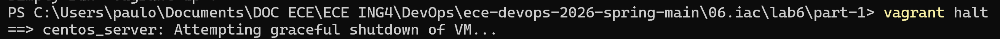

La commande « Vagrand destroy » arrête et efface complètement la VM :
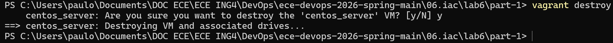

On restart la VM car on l’a détruite juste avant donc impossible de se connecter via SSH :
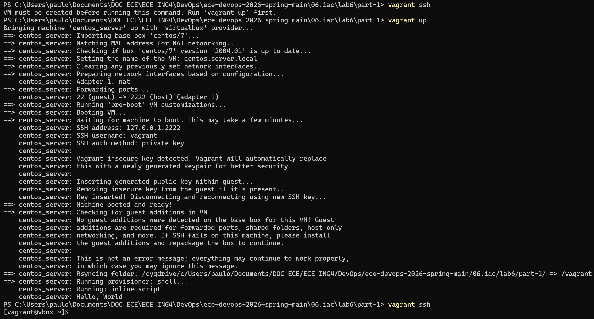

La VM a bien été créée : 
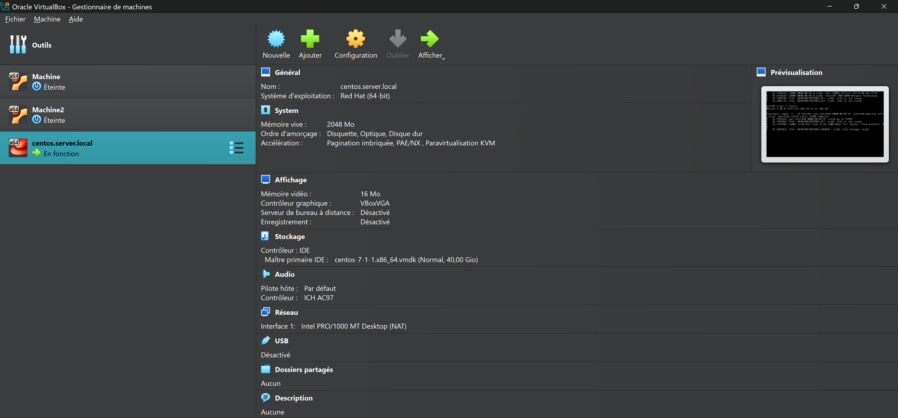

On a modifié le fichier dans le bloc note : 

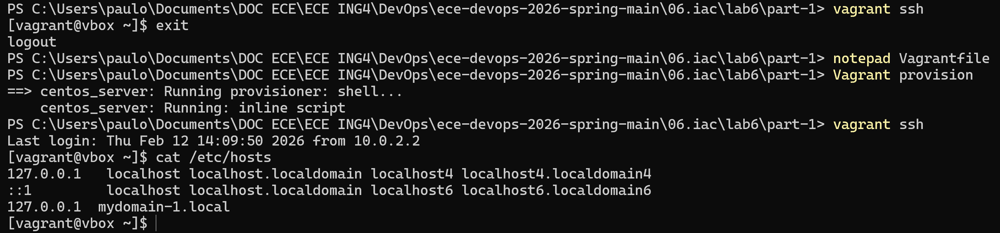
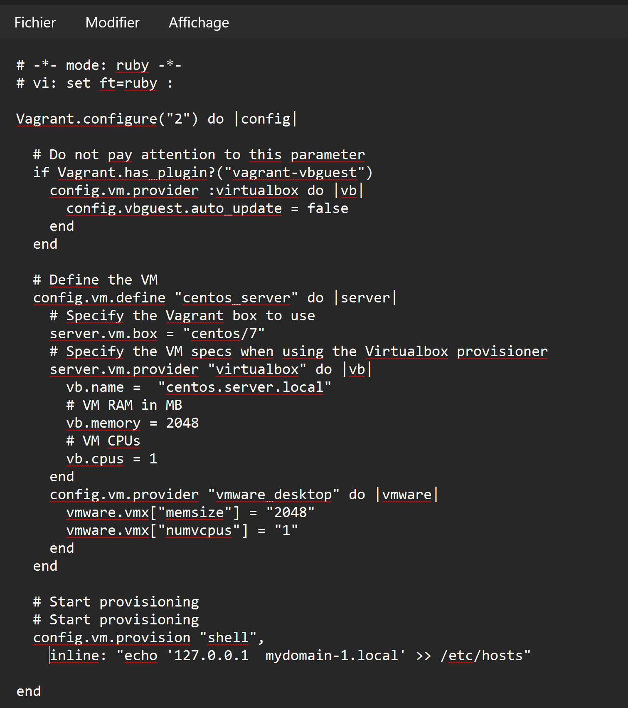
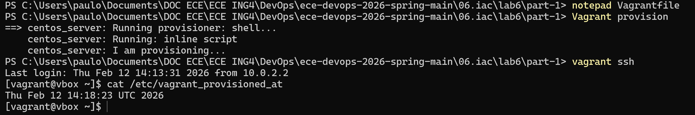

Ping afin de voir si Gitlab à bien été installé : 

On le voit également ici : 
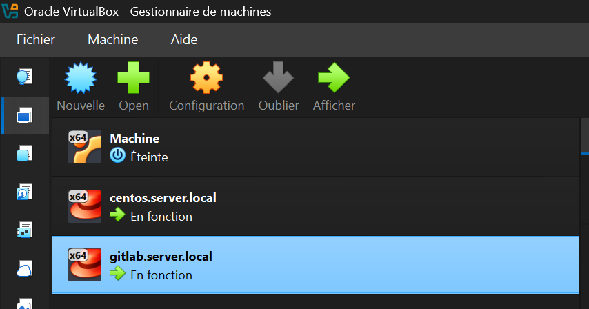

Mise à jour des playbooks sur la VM : 
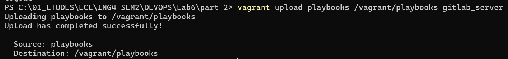

Exécution de la balise « check » :
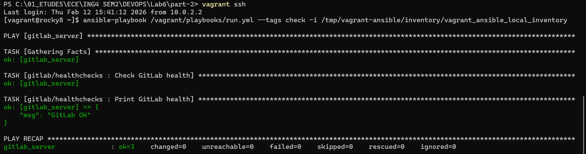
Message de retour « Gitlab Ok » qui termine le check

Exécution des deux autres types de contrôle d'intégrité, résultats de la console :
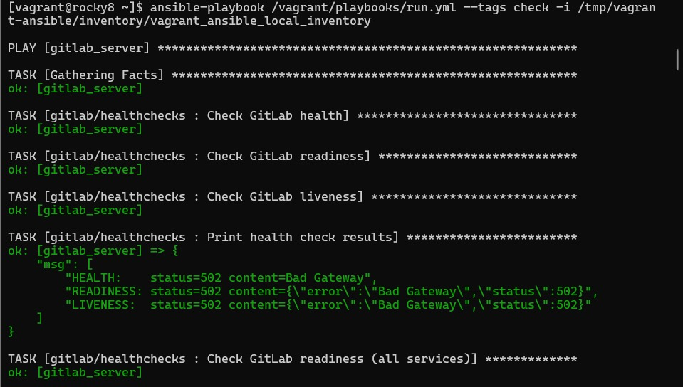

Tentative de connexion au localhost échoué à la fin :
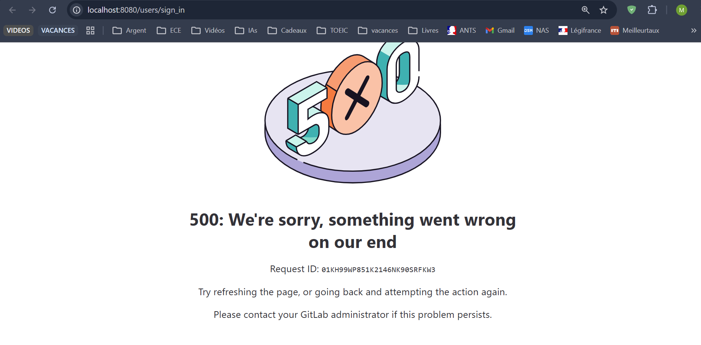