**Lab 8 Paul CHEVALIER & Mathis CAUCHIE**
## 1. Installation de minikube effectuée

## 2. Apprendre à utiliser les commande kubectl

1 à 5 - Ouverture du terminal, exécution de la commande 'deployment' avec le pod donné puis listage des pods en cours d'exécution et affichage des journaux du pod. Et enfin, l'éxecution de la commande à l'intérieur du pod :

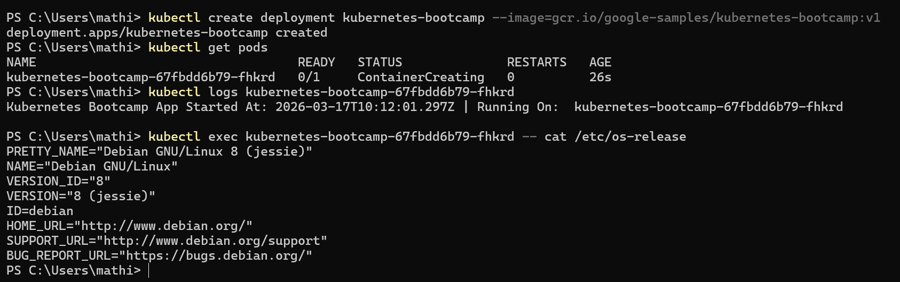

6 à 8 - Ouverture d'un shell à l'intérieur du pod puis affichage du contenu du répertoire avec 'ls' et lecture du fichier de code source JavaScript avec 'cat'. Enfin, exécution de la commande 'curl' pour s'assurer que l'application web répond à l'intérieur du conteneur :

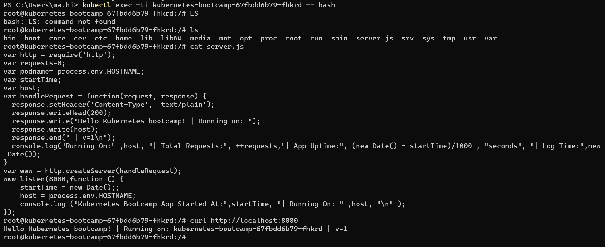

9 - On essaye d'interroger l'application web en dehors du pod mais une erreur apparait. On ne peut donc pas l'interroger

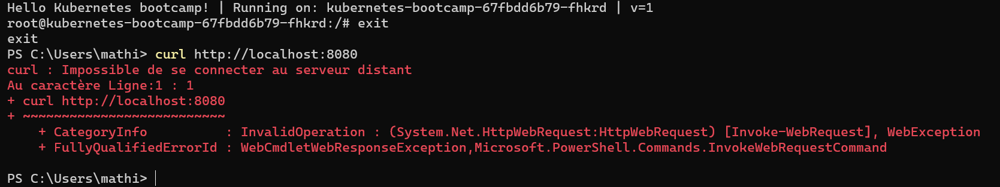

## 3. Apprendre à exposer un service Kubernetes à l'extérieur

1 à 4 - Exposition du déploiement que nous avons créé dans la première partie, détermination du port sur lequel le service a été connecté avec 'kubectl get services' (8080), récupération de l'adresse ip de la machine virtuelle grâce à la commande 'minikube ip' (192.168.49.2) puis enfin on tente d'accéder à l'application Web avec 'minikube service $SERVICE_NAME'

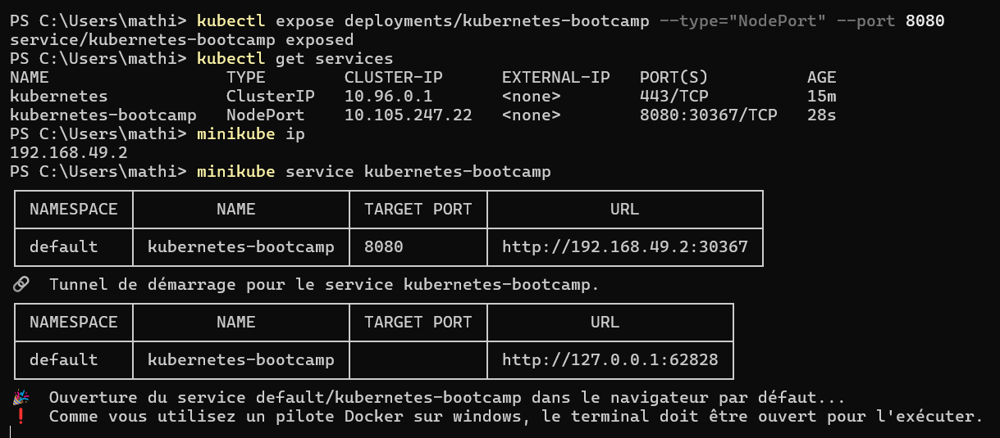

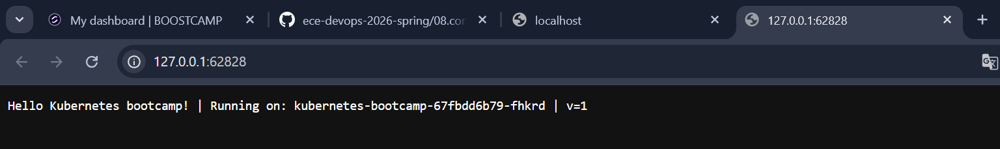

## 4. Apprenez à faire évoluer un déploiement Kubernetes à la hausse et à la baisse.

1 & 2 - On étend le déploiement au nombre total de 5 pods et on vérifie si les 5 pods sont bien en cours d'exécution avec la commannde 'get pods' : 

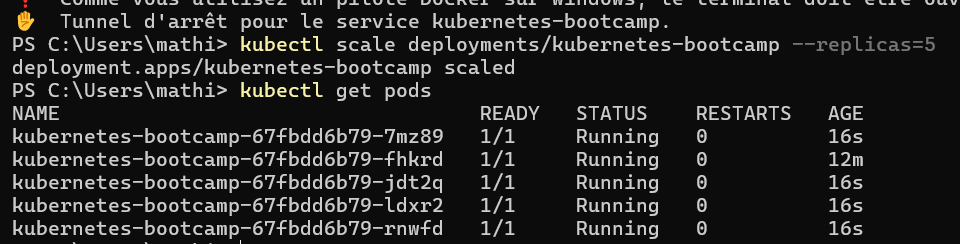

3 - On force l'actualisation plusieurs fois et on se rend compte que le nom de domaine change comme le montre les deux images suivantes lors du forcage de l'actualisation : 

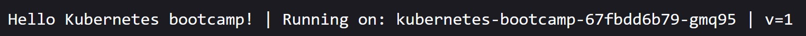
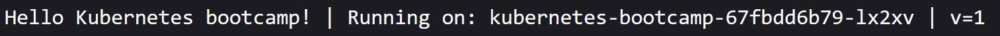

4 - On réduit notre déploiement à 2 pods et on vérifie que les 3 autres ne sont plus en cours d'exécution avec 'get pods' :

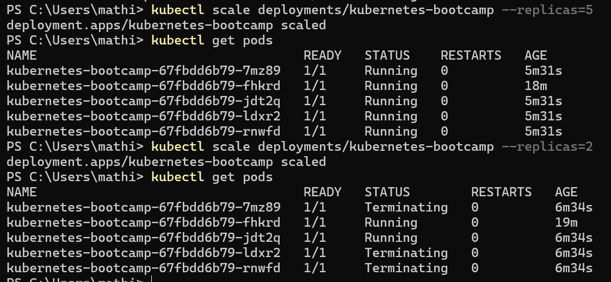

On voit bien que le STATUS de 3 des 5 pods précédent sont passés de 'Running' à 'Terminating'

## 5. Exécution d'une application multi-pods dans Kubernetes

1 à 3 - On met à jour l'image Docker avec la commande donnée et on regarde ce qu'il se passe sur la page Web :

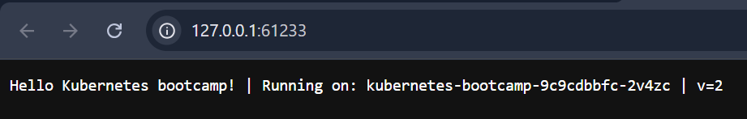

On se rend compte que la version est passée de v1 à v2 er que les 5 dernières lettres/numéros ont changés.

4 & 5 - On met à jour l'image Docker une nouvelle fois, puis on liste tous les pods.

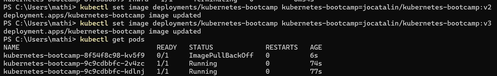

On se rend compte que les v2 et v3 ont le status 'Running' tandis que la v1 à un status 'ImagePullBackOff'

6 & 7 - Annulation de l'opération puis rétablissement du service à l'image que nous avions initialement choisie : 
 
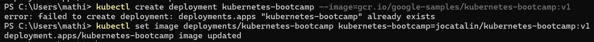

## 6. Déploiement d'une application à l'aide de fichiers YAML Manifest

1 à 3 - On nettoie ce qu'on a fait dans la partie précédente puis en complète le champs vide du fichier 'deployment.yaml' afin de définir un déploiement basé sur celui exécuté dans la partie 2.
Enfin, on exécute la commande 'kubectl apply -f deployment.yaml'
 
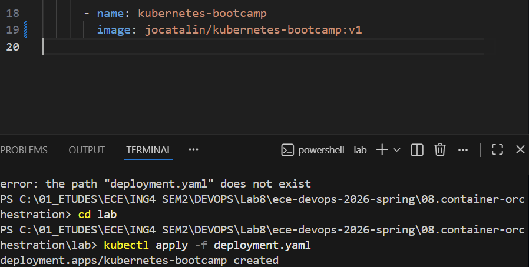

On voit que : "le déploiement à été créé"
Les capsules fonctionnennt comme on peut le voir ci-dessous avec 'get pods' :

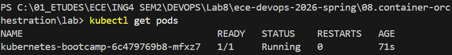

4 - On remplie les champs vides du fichier service.yaml avec le numéro de port '8080' et le nom de notre domaine qui est ici : 'kubernetes-bootcamp-service'

5 - On exécute la commande pour lancer le service et on obtient : 

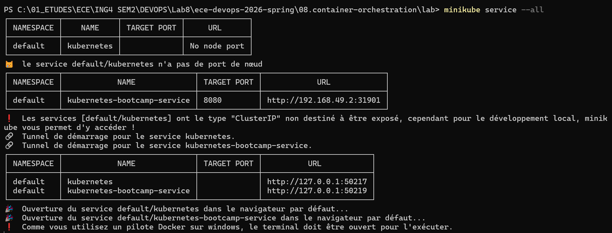

6 & 7 - On remplit le 2è champs du fichier 'deployment.yaml' et on exécute la commande donnée : 

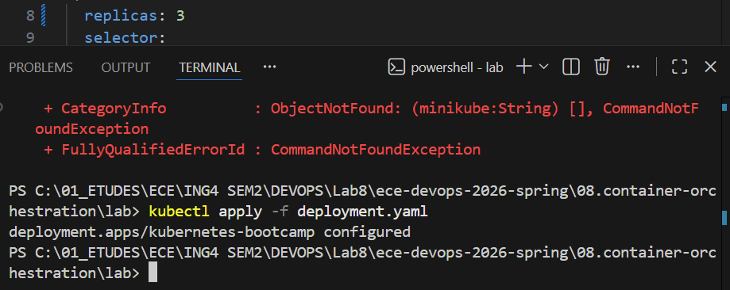

On voit que le déploiement à été 'configuré'

8 - On nettoie le cluster comme précédemment et on arrête minikube avec 'minikube stop'
